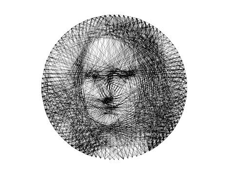

# Winding
一根线绕出一副人像画 
偶然看了一个视频 一个人用一根线绕出一幅画 觉得蛮有意思的 就自己用matlab写了个程序试了试 效果如图

## 补充：
后来查了查，国内这种东西好像叫绕线画，国外一个艺术家[petros vrellis](http://artof01.com/vrellis/)做这个比较出名 然后上他的网站看了看 他介绍说他使用的正式做这种图的软件在[这个网站](https://openframeworks.cc/)可以找到。

还有一部分工作残留 主要为：
- 搜了一些此类的艺术作品 发现他们的钉子并不只局限在圆周上 如果在五官等特征点上加上几个钉子效果会更好 写代码的时候没有考虑这一点 可以考虑使用opencv等工具（或许matlab也有现成的特征点提取函数） 提取关键点后将其位置加入钉子位置列表即可。
- 程序输出的是一条一条线 不是连续的。 这并不是问题 考虑最终结果 根据欧拉定理 只要钉子上面的线的数量为奇数的钉子个数小于等于两个 那必然可以一笔连成。如果大于两个的话，将多出来的那几个钉子两两相连即可。由于并不打算实际操作，所以这一步省略掉了。
